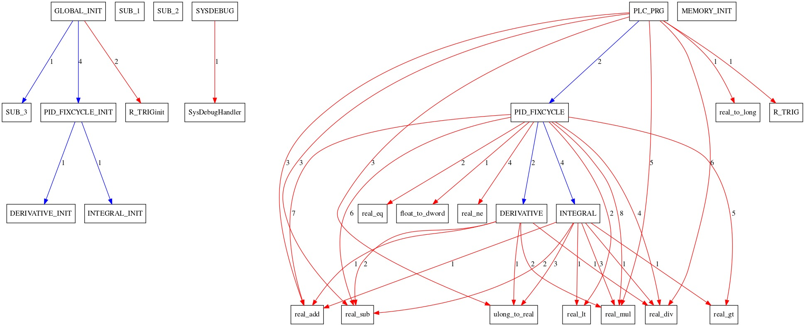

*****************************************
ICSREF: ICS Reverse Engineering Framework
*****************************************

Overview
========

``ICSREF`` is a modular framework that automates the reverse engineering process of CODESYS_ binaries compiled with the CODESYS v2 compiler.

.. code-block:: none

        _______________ ____  ____________
       /  _/ ____/ ___// __ \/ ____/ ____/
       / // /    \__ \/ /_/ / __/ / /_    
     _/ // /___ ___/ / _, _/ /___/ __/    
    /___/\____//____/_/ |_/_____/_/       
                               

by Tasos Keliris `\@koukouviou`_

.. _`\@koukouviou`: https://www.twitter.com/koukouviou

Cite us!
========
If you find our work interesting and use it in your (academic or not) research, please cite our NDSS'19 paper describing ICSREF:

Anastasis Keliris, and Michail Maniatakos, "ICSREF: A Framework for Automated Reverse Engineering of Industrial Control Systems Binaries", in NDSS'19.

Bibtex:

.. code-block:: none

    @inproceedings{keliris2019icsref,
    title={{ICSREF}: A Framework for Automated Reverse Engineering of Industrial Control Systems Binaries},
    author={Keliris, A. and Maniatakos, M.},
    booktitle={Network and Distributed System Security Symposium (NDSS)},
    year={2019}
    }

Preview
=======

.. raw:: html

    <embed>
        
    </embed>

Analyses
========

The framework can:

* Perform core analysis of arbitrary ``PRG`` programs. Core analysis includes:
    1. Delimitation of binary blobs (i.e., functions/routines).
    2. Identification of calls to dynamic libraries.
    3. Identification of calls to static libraries (other locations in the same binary).
    4. Identification of how many and which physical I/Os the binary uses, provided a TRG file that contains the memory mappings of physical I/Os of the particular device the binary is compiled for.

* Identify known library functions included statically in the binary:
    1. Using an opcode-based hash matching technique
    2. Using experimental signature-based techniques. This is at the moment only implemented for Proportional-Integral-Derivative (PID) CODESYS library functions.

* Extract arguments passed to static functions. This is at the moment only implemented for the PID_FIXCYCLE CODESYS library function, but it is trivial to extend this to other functions of interest.
    1. Argument extraction is powered by symbolic execution and ``angr``
    2. It can handle cases where the arguments are not impacted by I/O measurements (i.e., defined globally or passed directly)

* Plot SVG graphs of the analyzed binary, including:
    1. Calls between static functions
    2. Calls to dynamic functions
    3. Hyperlinks to the disassembly listings of each function from the SVG

Graphs are powered by Graphviz_. Here's a neat example:

.. _CODESYS: https://www.codesys.com/
.. _Graphviz: https://graphviz.org/

The framework supports an interactive mode, where all the processing modules are loaded. Users can further investigate and analyze their binaries by exploring the different options. The interactive environment also offers useful `help` docstrings.

.. code-block:: none
    
    (icsref) me@example:$ ./icsref.py

    ICS Reverse Engineering Framework
        _______________ ____  ____________
       /  _/ ____/ ___// __ \/ ____/ ____/
       / // /    \__ \/ /_/ / __/ / /_    
     _/ // /___ ___/ / _, _/ /___/ __/    
    /___/\____//____/_/ |_/_____/_/       
                               
    author: Tasos Keliris (@koukouviou)
    Type <help> if you need a nudge
    reversing@icsref:$ 
    reversing@icsref:$ help

    Documented commands (type help <topic>):
    ========================================
    __changepid         changepid       exp_pid_match  history  pyscript  set      
    __replace_callname  cleanup         graphbuilder   load     quit      shell    
    _relative_load      cmdenvironment  hashmatch      pidargs  run       shortcuts
    analyze             edit            help           py       save      show     

Installation
============

For the latest installation instructions see INSTALL.md_. For the legacy installation instructions see here_.

.. _INSTALL.md: INSTALL.md
.. _here: INSTALL.rst

Documentation
=============

The ``ICSREF`` API is documented in a *Read the Docs* style. Once you download the repository you can traverse the docs directory and open index.html in your favorite browser.

Acknowledgements
================

``ICSREF``, as all things good in life, is based on the shoulder of giants. The framework relies on symbolic execution using ``angr`` for performing the most interesting analyses such as calculating offsets for static calls and the arguments to function calls. Disassembly listings for the graphing module are generated using the amazing ``r2``. The interactive mode of the tool is powered by the ``cmd2`` python tool. Beautiful documentation is generated with Sphinx and the sphinx_rtd_theme.

* `angr <http://angr.io/>`__
* `radare2 <https://rada.re>`__
* `cmd2 <https://github.com/python-cmd2/cmd2>`__
* `Sphinx <http://sphinx-doc.org/>`__
* `sphinx_rtd_theme <https://sphinx-rtd-theme.readthedocs.io/>`__

Contributors
============

A big thank you to everyone contributing on this project. See CONTRIBUTORS_

.. _CONTRIBUTORS: CONTRIBUTORS
